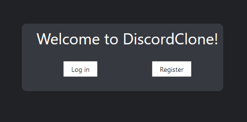
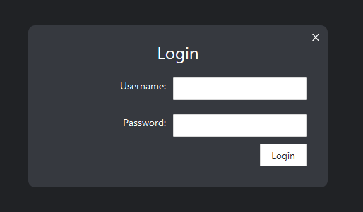
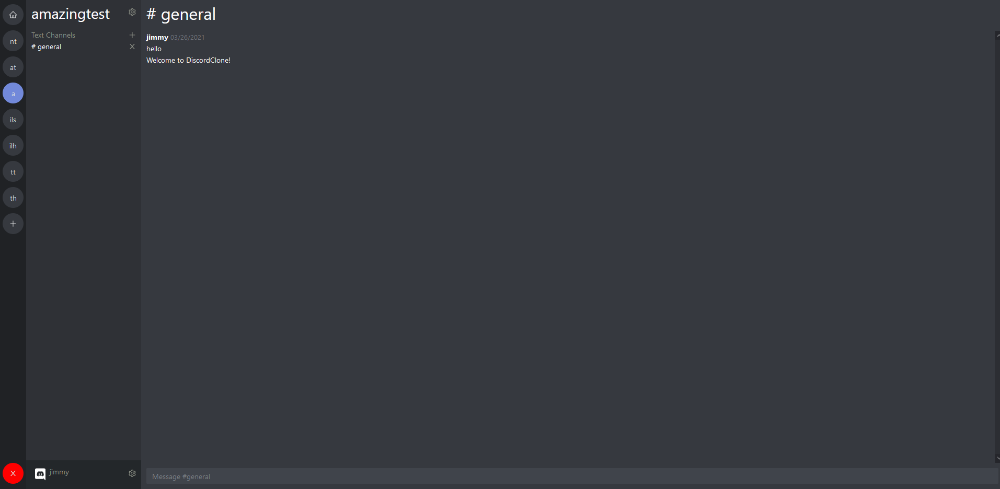

# DiscordCloneReact

DiscordCloneReact is a Discord Clone implemented using React for the frontend and C# with SignalR for the backend chatting functionality.

Take a look: [https://discordclonereact.azurewebsites.net/](https://discordclonereact.azurewebsites.net/)

---

## Welcome Page

---

## Login Page

---

## Homepage

---

## Chat for a sample channel

---

## Technologies used

- [React](https://reactjs.org/) - JavaScript library for building User Interfaces
- [.NET](https://docs.microsoft.com/en-us/dotnet/) - Used for backend API management
- [EF Core](https://docs.microsoft.com/en-us/ef/core/) - ORM (Object Relational Mapper) used in .NET to access databases
- [Microsoft SQL Server](https://www.microsoft.com/en-us/sql-server/sql-server-2019) - Microsoft Relational Database
- [antdesign](https://ant.design/) - UI framework for React
- [datefns](https://date-fns.org/) - JavaScript Date-parsing library
- [formik](https://formik.org/) - Popular form library for React
- [axios](https://github.com/axios/axios) - Http Client for node.js

---

## License

[MIT](https://choosealicense.com/licenses/mit/)
